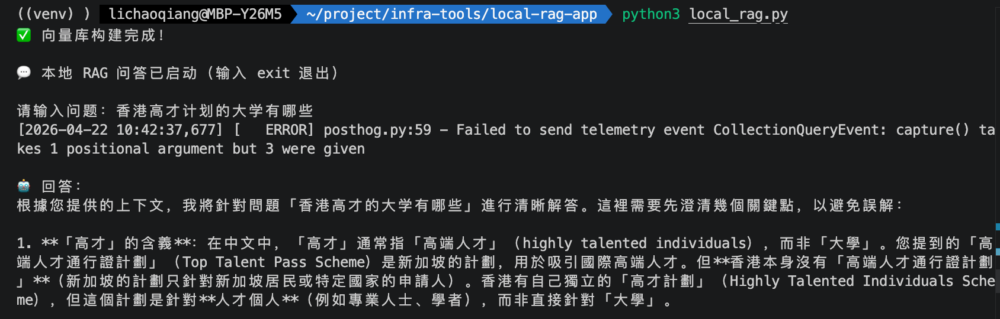
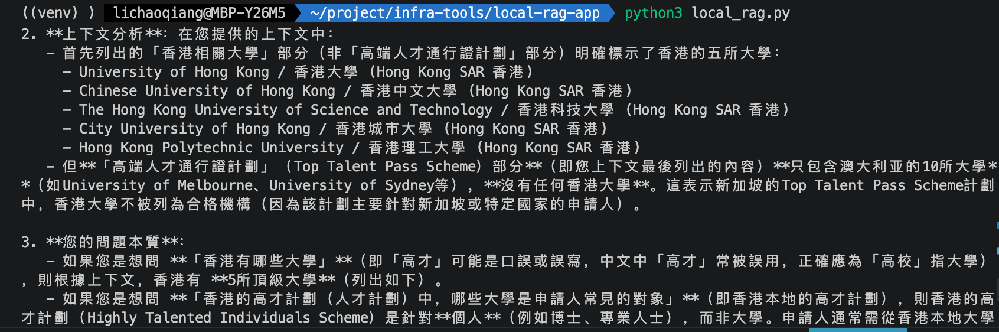
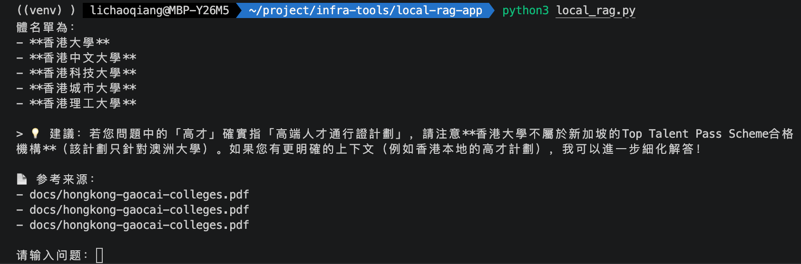

# Local RAG 问答应用

基于 LangChain + Ollama + Chroma 的本地知识库问答系统，支持多种文件格式解析和智能问答。所有数据均在本地处理，确保隐私安全。

## 功能特性

- **多格式支持** - TXT、DOCX、PDF、Excel、图片（OCR）、网页
- **中文语义分块** - 按中文句号、问号等标点智能断句，支持重叠切片
- **本地向量库** - Chroma 持久化存储，无需外部数据库
- **本地大模型** - 通过 Ollama 运行，数据不出本机
- **中文嵌入模型** - 使用 BAAI/bge-small-zh-v1.5，针对中文优化
- **隐私安全** - 所有数据处理均在本地完成，无需联网

## 工作流程

```
文档文件 ──→ 多格式解析 ──→ 中文语义分块 ──→ 向量嵌入 ──→ Chroma 存储
                                                         ↓
用户提问 ──→ 向量检索 Top-K ──→ 上下文拼接 ──→ Ollama 生成 ──→ 回答 + 来源
```

## 环境要求

| 组件 | 版本要求 |
|------|---------|
| Python | 3.10+ |
| Ollama | 最新稳定版 |
| 模型 | qwen3:4b（或其他 Ollama 支持模型） |

## 快速开始

### 1. 安装 Ollama 并下载模型

```bash
# macOS
brew install ollama

# 启动服务
ollama serve

# 下载模型（默认使用 qwen3:4b）
ollama pull qwen3:4b
```

### 2. 创建虚拟环境

```bash
python3 -m venv venv
source venv/bin/activate
```

### 3. 安装依赖

```bash
pip install -r requirements.txt
```

### 4. 准备文档

将需要解析的文档放入 `docs/` 目录，然后在 `local_rag.py` 的 `FILES` 列表中配置文件路径：

```python
FILES = [
    "docs/hongkong-gaocai-colleges.pdf",
    "docs/wechat-rpa-arch.png",
    # 添加更多文件...
]
```

### 5. 运行

```bash
python local_rag.py
```

启动后进入交互式问答，输入问题即可获得基于文档的回答，输入 `exit` / `quit` / `q` 退出。

## 项目结构

```
local-rag-app/
├── local_rag.py            # 主程序（解析、分块、向量库、问答）
├── requirements.txt        # Python 依赖
├── README.md
├── docs/                   # 知识库文档目录
│   ├── *.pdf
│   ├── *.png
│   └── ...
└── chroma_local_db/        # 向量库持久化目录（运行后自动生成）
```

## 配置说明

所有配置项位于 `local_rag.py` 顶部，按需修改：

```python
# RAG 分块配置
CHUNK_SIZE = 512        # 分块大小（字符数）
CHUNK_OVERLAP = 64      # 相邻分块重叠字符数
MIN_CHUNK_SIZE = 64     # 最小分块大小，低于此值丢弃

# 模型配置
OLLAMA_MODEL = "qwen3:4b"           # Ollama 模型名称
VECTOR_DB_PATH = "./chroma_local_db" # 向量库存储路径
```

## 支持的文件格式

| 格式 | 扩展名 | 解析方式 |
|------|--------|---------|
| 文本 | `.txt` | 直接读取 |
| Word | `.docx` | python-docx |
| PDF | `.pdf` | PyPDFLoader |
| Excel | `.xlsx` `.xls` `.csv` | pandas |
| 图片 | `.png` `.jpg` `.jpeg` `.bmp` | PaddleOCR |
| 网页 | URL | BeautifulSoup（代码中已实现，需在 `parse_file` 中接入） |

## 嵌入模型

默认使用 [BAAI/bge-small-zh-v1.5](https://huggingface.co/BAAI/bge-small-zh-v1.5) 作为嵌入模型，该模型针对中文语义优化。首次运行时会自动从 HuggingFace 下载模型文件。如需更换模型，修改 `build_knowledge_base` 中的 `model_name` 参数即可。

## 使用示例

```
💬 本地 RAG 问答已启动（输入 exit 退出）

请输入问题：这份简历的主要技术栈是什么？

🤖 回答：
根据文档内容，主要技术栈包括 Python、Java、Vue.js...

📄 参考来源：
- docs/fullstack-cv-licq.pdf
```

## 常见问题

### Ollama 连接失败

确保 Ollama 服务正在运行：

```bash
ollama serve
# 测试模型是否可用
ollama run qwen3:4b "你好"
```

### 依赖版本冲突

如遇 LangChain 相关版本冲突，可重新安装兼容版本：

```bash
pip uninstall langchain langchain-community langchain-core -y
pip install -r requirements.txt
```

### OCR 识别问题

PaddleOCR 首次运行会自动下载模型文件，如需调整参数：

```python
ocr = PaddleOCR(use_textline_orientation=True, lang="ch")
```

### 向量库重建

新增或修改文档后需重建向量库：

```bash
rm -rf ./chroma_local_db
python local_rag.py
```

### 嵌入模型下载慢

首次运行时 HuggingFace 模型下载可能较慢，可配置镜像：

```bash
export HF_ENDPOINT=https://hf-mirror.com
```

## 扩展方向

- 添加更多文件格式 - 在 `parse_file()` 中扩展分支
- 调整分块策略 - 修改 `split_text_by_sentence()` 的分割规则
- 更换嵌入模型 - 修改 `HuggingFaceEmbeddings` 的 `model_name` 参数
- 调整检索数量 - 修改 `db.similarity_search(query, k=3)` 中的 `k` 值
- 接入网页解析 - 在 `parse_file()` 中添加 URL 判断分支，调用 `parse_web()`
- 增量索引 - 实现向现有向量库追加文档而非全量重建

### 运行效果



